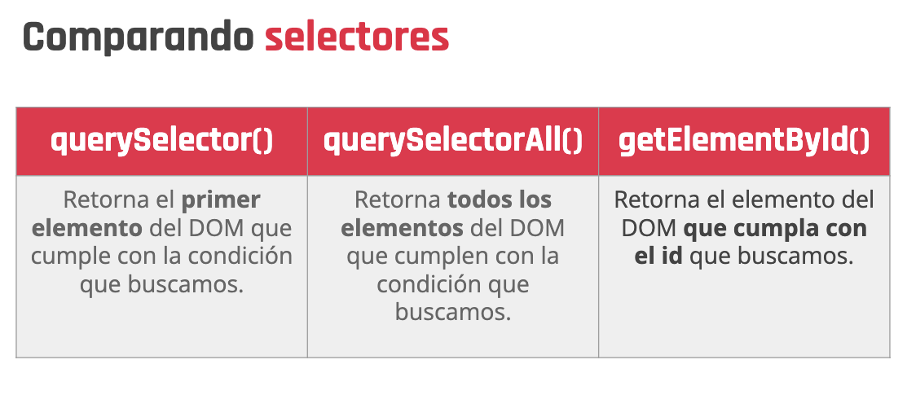
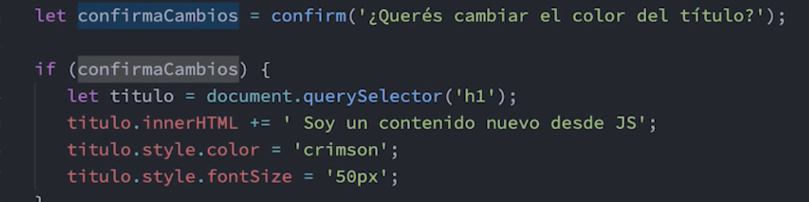
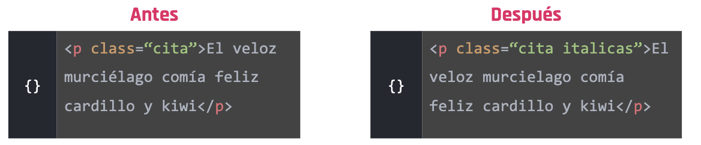
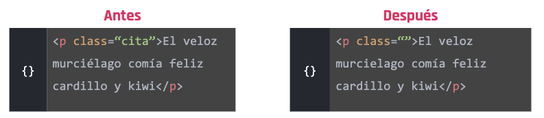
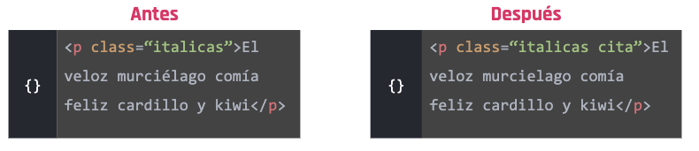
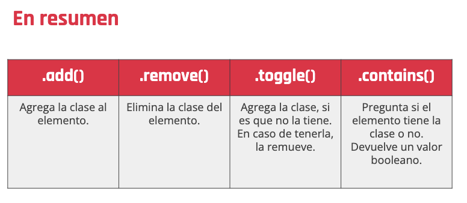

# Temas del modulo
* Ejecutar código JavaScript desde el front-end.

* Implementar funcionalidades dinámicas al DOM (contenido HTML del documento).

* Entender y aplicar los eventos de JavaScript.

* Consumir información que venga desde una API directamente en el front-end.

* Entender cómo se pueden comunicar el front-end y el back-end a través de solicitudes asincrónicas.

Vamos a utilizar JavaScript del lado del front-end para poder darle interactividad al sitio web, jugando con las interacciones del usuario y la interfaz gráfica de la aplicación. Además vamos a conocer cómo se realizan pedidos de información a recursos externos para generar un esquema de comunicación mucho más ligero y performante.

# Clase 44

* Cómo vincular un documento de JavaScript directamente con las vistas de nuestra aplicación.

* Qué son los objetos Window y Document, y el por qué de su importancia.

* Cómo poder seleccionar los elementos del documento HTML con JavaScript.

* Cómo editar el contenido de texto de los elementos presentes en el HTML.

* Cómo modificar los estilos CSS de los elementos HTML.

## Vinculacion 
**2 Tipos de validaciones**

   * Interna
   * Externa

### Validacion Interna
Nos permite escribir codigo JS en nuestro archivo HTML, no es una forma prolija de hacerlo

```HTML
<body>
   ...
   <script>
       console.log(“Hola Mundo!”);
   </script>
</body>
```

### Validacion Externa
Nos permite linkear nuestro archivo HTML con archivos JS externos

```HTML
<body>
   ...
 <script src=“js/main.js” type="text/javascript">
 </script>
</body>
```

El uso de la vinculacion externa, no es necesario escribir las etiquetas <script> dentro de nuestro archivo con extension .js

```javascript
let saludo = 'Hola mundo!';
   console.log(saludo);
```

#### Buena practica
Vinculamos los archivos de JavaScript antes del final del body? Esta es una de las buenas prácticas que generalmente deberemos implementar al momento de trabajar con JavaScript del lado del front-end.

## Objeto Window y Document
“El objeto window representa la ventana que contiene al documento y el objeto document representa al DOM (documento HTML) cargado en esa ventana.”

Hay que recordar que el DOM (Document Object Model) representa al documento que se carga en el navegador como un árbol de nodos, en donde cada nodo representa una parte del documento. Veamos esto visualmente en un ejemplo:


En resumen, window y document es la manera en la que JavaScript nos da acceso a los elementos presentes en el documento HTML para que a través de estas funcionalidades podamos manipular el contenido según nuestro criterio y necesidades.

Si bien repasamos en líneas generales las funciones y los métodos más utilizados de los objetos window y document, no hay que dejar de explorar todas sus bondades. En estos links podemos acceder a la documentación y encontrar todo lo que podemos crear con JavaScript desde el front-end:


### Document
[Documente](https://developer.mozilla.org/es/docs/Web/API/Document)

### Window
[Window](https://developer.mozilla.org/es/docs/Web/API/Window)


## DOM Selectores
Es la forma en la que JS interpreta al contenido HTML.

Selectores, que son una particularidad del lenguaje que nos permite elegir y "capturar" a un elemento puntual, o varios, de la estructura de nuestro HTML.

Para acceder a los elementos de una pagina, usamos selectores, cada selector puede retornar un solo elemento o una lista de elementos

 * Para usarlos se usa el objento Documento, ya que los selectores son metodos del mismo

### querySelector()
Este selector recibe un string que indica el selector CSS del elemento del DOM que estamos buscando.

```Javascript
let titulo = document.querySelector('.title');
```
Nos va a retornar el primer elemento del HTML que contenga la clase “title”.

### querySelectorAll()
Este selector recibe un string que indica el selector CSS del elemento del DOM que estamos buscando.

```javascript
let nombres=document.querySelectorAll('.name');
```
Nos va a retornar un listado de elementos que coincidan con la búsqueda 
especificada. 

También podemos utilizar los selectores directamente con elementos del documento

```javascript
let div=document.querySelectorAll('div');
```

### getElementById()
Este selector recibe un string con únicamente el nombre del id del elemento del DOM que estamos buscando

```javascript
let marca=document.getElementById('marca');
```
Nos va a retornar el elemento cuyo id coincida con el deseado

También podemos buscar elementos por su id mediante los selectores anteriores, pero debemos anteponer un # para aclarar que es un id.

```javascript
let marca=document.querySelector('#marca');
```



## Modificando el DOM
Para poder hacer modificaciones al DOM siempre tenemos que tener seleccionado el objeto que queremos modificar. Esto lo podemos hacer usando selectores.

### .innerHTML
* Si queremos leer o modificar el contenido de una etiqueta HTML, vamos a utilizar esta propiedad.

```javascript
document.querySelector('div.nombre').innerHTML ;
```

* Para modificar el contenido de una etiqueta HTML, vamos a utilizar esta propiedad de la siguiente manera.

```javascript
document.querySelector('div.nombre').innerHTML = 'Darío';
```
Si utilizamos la propiedad de esta forma, todo el contenido que teníamos en el div con clase nombre se va a cambiar por el string “Darío”.

* Para modificar el contenido de una etiqueta HTML, sin perder el contenido que ya estaba, vamos a utilizar esta propiedad de la siguiente manera:

```javascript
document.querySelector('div.nombre').innerHTML += 'Papitas';
```
De esta forma, estamos agregando al div con clase compras la palabra “Papitas”. De tal manera que si lo leyéramos

```HTML
<div class="compras"> “Jamón, Queso, Pan” Papitas</div>
```

### .innerText
* Si queremos leer o modificar el texto de una etiqueta HTML, vamos a utilizar esta propiedad

```javascript
document.querySelector('div.nombre').innerText ;
```
En este caso, si en mi div con clase nombre estuviera escrito “Leo”, la propiedad me retornaría el string “Leo”.

* Si queremos modificar el texto de una etiqueta HTML, vamos a utilizar esta propiedad de la siguiente manera

```javascript
document.querySelector('div.nombre').innerText = 'Maria';
```
Si utilizamos la propiedad de esta forma, todo el texto que teníamos en el div con clase nombre se va a cambiar por el string “Maria”

* Si queremos agregar contenido al texto de una etiqueta HTML, vamos a 
utilizar esta propiedad de la siguiente manera:

```javascript
document.querySelector('div.nombre').innerText += 'Messi';
```
En este caso, lo que sucedería es similar a lo que sucede con el otro selector, pero el texto se incluiría dentro de la etiqueta div, quedando

```HTML
<div class= “nombre”>Leo Messi</div>
```

### Propiedad Style
Nos permite leer y sobreescribir las reglas CSS que se aplican sobre un elemento que hayamos seleccionado.

```javascript
let titulo = document.querySelector('.title');
titulo.style.color = 'cyan';
titulo.style.textAlign = 'center';
titulo.style.fontSize = '12px';
titulo.style.backgroundColor = '#dddddd';
```

## Modificando estilos del CSS
Con las funcionalidades que nos aporta el DOM de JavaScript, además de poder agregar y modificar el contenido de texto de un elemento presente en el HTML, podemos incluso agregar y eliminar estilos de CSS.

Por ejemplo: 

documento.querySelector("h1").style.color

documento.querySelector("h1").style.backgroundColor





## Modificando Clases
JavaScript nos da una propiedad y varios métodos que nos permiten hacer diversas acciones con el atributo class de un elemento

### classList.add()
Nos permite agregar una clase nueva al elemento que tengamos seleccionado
``` javascript
let cita = document.querySelector('.cita');
cita.classList.add('italicas');
```


### classList.remove()
Nos permite quitarle una clase existente al elemento que tenemos seleccionado.
```javascript
let cita = document.querySelector('.cita');
cita.classList.remove('cita');
```

### classList.toggle()
Revisa si existe una clase en el elemento seleccionado. De ser así, la remueve, de lo contrario, si la clase no existe, la agrega
```javascript
let cita = document.querySelector('p');
cita.classList.toggle('cita');
```


### classList.contains()
Nos permite preguntar si un elemento tiene una clase determinada. Devuelve un valor booleano.
```javascript
let cita = document.querySelector('.italicas');
cita.classList.contains('cita'); // false
```

```javascript
let cita = document.querySelector('.italicas');
cita.classList.contains('italicas'); // true{}
```
Podemos usar el .contains para hacer operaciones lógicas haciendo uso de los if/else.

