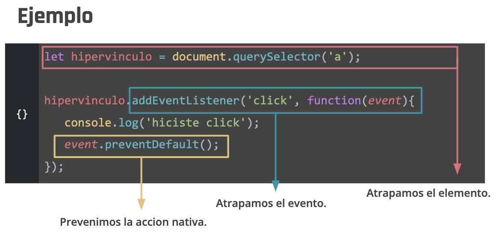
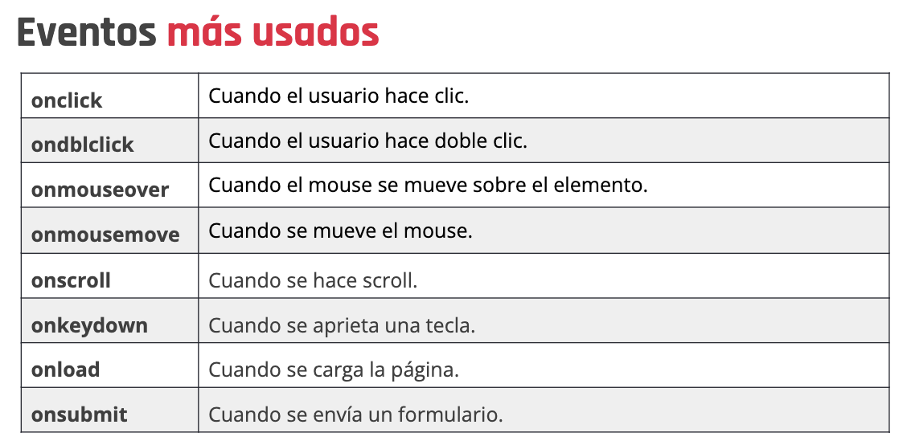

# Clase 45

Puntualmente, al terminar esta clase podremos:

* Entender qué es un evento y sus casos de uso.
* Saber cómo asignar eventos a los elementos del DOM.
* Diferenciar claramente los eventos del mouse de los eventos del teclado.
* Entender y asimilar el concepto de "listener".
* Saber manipular y administrar el evento en sí.

# Que son los eventos?
Un evento es algo que pasa en el documento HTML y que comúnmente es ejecutado por parte de la persona que usa nuestro aplicativo.

Ejemplo: 

* La persona hizo clic en un botón de la interfaz.
* La persona ingresó un texto en el input del formulario.
* La persona presionó exactamente la tecla "J".

Un evento es esa acción que se desencadena cuando la persona ejecuta una acción determinada.

**Un evento es una acción que transcurre en el navegador o que es ejecutada por el usuario**


## onload
Este evento permite que todo el script se ejecute cuando se haya cargado por completo el objeto document dentro del objeto window

```js
window.onload = function(){
   console.log('el documento está listo');
}
```

## onclick
Este evento nos permite ejecutar una acción cuando se haga clic sobre el elemento al cual le estamos aplicando la propiedad.

```js
btn.onclick = function(){
   console.log('hiciste clic!');
}
```

## preventDefault()
Nos permite evitar que se ejecute el evento predeterminado —o nativo— del elemento al que se lo estemos aplicando.
Podemos usarlo, por ejemplo, para prevenir que una etiqueta “a” se comporte de manera nativa y que haga otra acción

```js
let hipervinculo = document.querySelector('a');

hipervinculo.addEventListener('click', function(event){
   console.log('hiciste click');
   event.preventDefault();
});
```





# Eventos de mouse
 Veremos aquellos eventos que podemos ejecutar con el mouse y que nos servirán muchísimo para darle mayor interacción a nuestros sitio web.


## mouseOver
```js
let texto = document.querySelector('.text');
texto.onmouseover = function(){
   console.log('pasaste el mouse');
}
```
```js
texto.addEventListener('mouseover', function(){
   console.log('pasaste el mouse');
});
```

## mouseOut

```js
let texto = document.querySelector('.text');
texto.onmouseout = function(){
   console.log('quitaste el mouse');
}
```

```js
texto.addEventListener('mouseout', function(){
   console.log('quitaste el mouse');
});
```

> Como podemos notar, aplicar el evento con un .on"evento" o con un addEventListener("evento", function{... etcétera, ¡no tiene diferencia!

# Evento de teclado

## onkeydown

Este evento es lanzado cuando una tecla es presionada (hacia abajo). A diferencia del evento keypress, keydown es lanzado para las teclas que producen un carácter y también para las que no lo producen.

```js
let miInput = document.querySelector('#miInput');
   miInput.onkeydown = function(event){
       alert("Se presionó la tecla: "+ event.key);
}
```

## onkeyup
Este evento se dispara únicamente cuando la tecla se suelta.

```js
let miInput = document.querySelector('#miInput');
   miInput.onkeyup = function(event){
       alert("Se soltó la tecla: "+ event.key);
}
```

## onkeypress
Este evento se dispara al finalizar el recorrido de presión y liberación de la tecla. 
```js
let miInput = document.querySelector('#miInput');
   miInput.onkeypress = function(event){
       alert("Se presionó la tecla: "+ event.key);
}
```