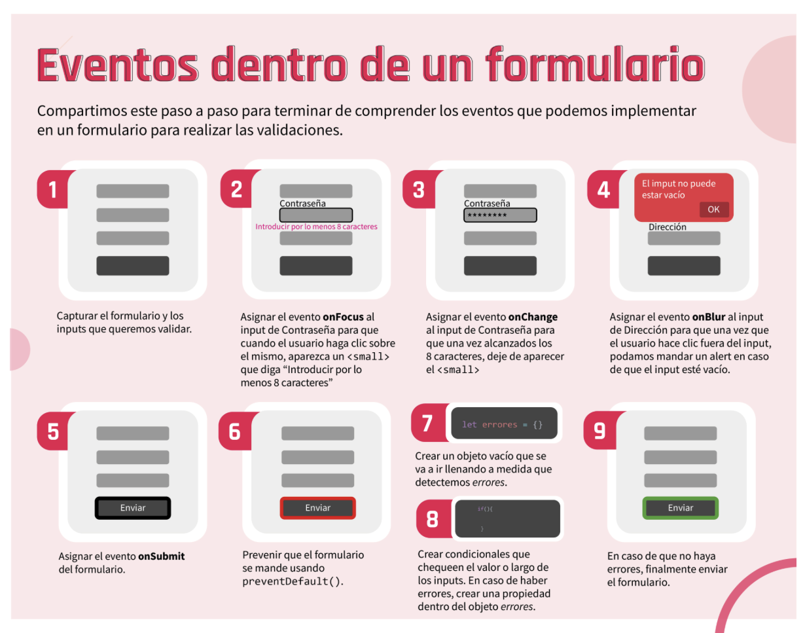

# CLASE 46 - Los formularios y su validación.

Al terminar esta clase estaremos en la capacidad de:

* Identificar cuáles son los eventos que JavaScript tiene para manipular los formularios HTML.
* Diferenciar los eventos para los campos de los eventos del formulario.
* Implementar validaciones de datos sencillas e intermedias.
* Entender la importancia de realizar validaciones del lado del front-end.

# Eventos de formularios

## onfocus
El usuario entro con el cursor a un campo input


```js 
window.addEventListener("load", funcion(){
    let campoNombre = document.queryselector(".name");

    campoNombre.addEventListener("focus", fuction(){
        console.log(1);
    })
})
```


## onblur
El usuario abandono el campo input

```js 
window.addEventListener("load", funcion(){
    let campoNombre = document.queryselector(".name");

    campoNombre.addEventListener("blur", fuction(){
        console.log(1);
    })
})
```


## onchange
Permite identificar que el valor de un campo cambio. 

Se aplica sobre cualquier campo del formulario

```js 
window.addEventListener("load", funcion(){
    let campoNombre = document.queryselector(".name");

    campoNombre.addEventListener("change", fuction(){
        console.log(1);
    })
})
```

## onsubmit
Identifica el momento en el que se clickea sobre un boton 
* Se incluye la fx: preventDefault

* This.value : retorna la info que estamos solicitando 


```js 
window.addEventListener("load", funcion(){
    let form = document.queryselector("form.reservation");

    form.addEventListener("submit", fuction(e){
        if (el formulario esta ok){

        }
        else{
            e.preventDeFault();
        }
        console.log(1);
    })
})
```



# Validaciones
Esto se denomina validación "on time" y no solamente nos sirve para procurar una limpieza de los datos, sino que a su vez nos ayuda a garantizar una excelente user experience. 

## Capturar el formulario
El primer objetivo será obtener el formulario. Para esto tenemos dos opciones

```js
let formulario = document.querySelector("form.reservation"
```

```js
let formulario = document.forms["reservation"
```

## Eventos del formulario
El evento submit es aquel que se ejecuta cuando enviamos los datos.
```js
formulario.addEventListener("submit", function(event){});
```
```js
formulario.onsubmit = (event) => {}JS
```

## Validando los campos
Podemos obtener nuestro input con querySelector para que finalmente preguntemos si el valor campo está vacío.

```js
event.preventDefault();
let campoNombre = document.querySelector("input.nombre");
if(campoNombre.value == ""){
   alert("El campo nombre no debe estar vacío");
}

//Para detener el envío de formulario usamos: event.preventDefault()
```

## Almacenar los errores
Creamos un array para acumular estos errores y cambiar nuestra lógica. Es decir, si el array no está vacío, entonces prevenimos el envío del formulario, caso contrario, el formulario se enviará

```js
let errores = [];
let campoNombre = document.querySelector("input.nombre");
if(campoNombre.value == ""){
   errores.push("El campo nombre está vacío");
}
if(errores.length > 0){
   event.preventDefault();
}
```

## Mostrando errores
```html
<section class="errores">
   <ul>
       ...
   </ul>
</section>
```

```js
if(errores.length > 0){
   event.preventDefault();
   let ulErrores = document.querySelector(".errores ul");
   errores.forEach(error => {
       ulErrores.innerHTML += `<li>${error}</li>`
   });
}
```
