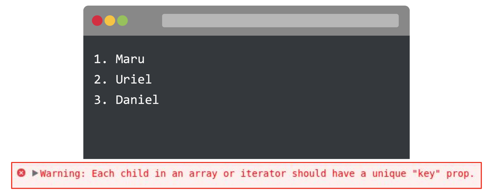

# CLASE 51 - Trabajando con componentes 

* Props
* Key Props y .map()
* Prop types y default props
* Children
* Styling

# Props
Las props son los datos internos de un componente. Representan información que es enviada al momento en el que un componente es utilizado. Estas nos van a permitir que la información interna del componente sea variable para que podamos tener estructuras HTML realmente dinámicas y 100% reutilizables.

## Definición de props
Esta función es un componente de React válido porque acepta un solo argumento de objeto “props” (que proviene de propiedades) con datos y devuelve un elemento de React. 
Llamamos a dichos componentes “funcionales” porque literalmente son funciones JavaScript.

```js
function Bienvenido(props) {
 return (
   <div>
       <h1>
         Hola, { props.nombre }
       </h1>
   </div>
 );
}
```

La forma más sencilla de definir una props es escribir una función de JavaScript.  
El componente no retornará texto fijo, sino que el mismo retornará el contenido de acuerdo al valor de sus propiedades.

## Implementación de props
Las propiedades de un componente reciben sus respectivos valores, cuando el componente es invocado por la aplicación.

```js
<Bienvenido
     nombre =  "Victor Luis" 
     />
```
Cuando llamamos al componente es donde definimos, con la siguiente sintaxis, el valor que va a llevar esa props. Podemos implementar más de una.

# Key Props y .map()
Analicemos este tema desde un ejemplo concreto. Asumamos que recibimos dentro de un componente, a través de las props, un array de objetos literales que representan la base de datos que queremos mostrar en nuestra vista.

Ya tenemos esa información dentro del componente y nuestro objetivo es que, por cada objeto literal dentro del array, se renderize una etiqueta <li) de HTML.

¿Cómo podremos llevar esto a cabo? ¿Será suficiente un iterador tipo for?

Dentro de un componente de React no es posible usar iteradores. Es por ello que debemos reemplazarlos por métodos que iteren asincrónicamente nuestra información. Es por esta razón que nos adentraremos nuevamente a ver el .map(), pero no sin perder de vista qué son las key props y por qué de la importancia de su existencia.

## .map()
Observemos cómo el array es pasado dentro del atributo con nombre items y que adicionalmente va entre llaves. Son estas llaves las que nos permiten escribir tipos de datos de JavaScript que no sean simplemente cadenas de texto. Así es como se define el valor de una props a través de un Array.

```js
const usuarios = ["Maru","Uriel","Daniel"];
<MiLista
     items = { usuarios }
     />
```
* En este ejemplo podemos observar que estamos pasando al componente MiLista, los usuarios que se encuentran en el array usuarios y los mismos son asignados a la variable items.

Dentro del componente, lo primero que tenemos que hacer es recibir las props como parámetro de la función. Luego, dentro de la estructura de JSX que hayamos definido, vamos a tener que iterar sobre el array recibido para poder imprimir los usuarios.


```js
function MiLista(props) {
 return (
   <div>
     <ol>
       {props.items.map(item => <li> {item} </li>)}
     </ol>
   </div>
 );
}
```
* El método que conviene implementar para iterar sobre el array e imprimir su contenido en React es map()

Así se vería en el navegador. Debemos estar atentos al error que nos aparece en las Dev Tools. ¡Vamos a solucionarlo!




## Key props
Las keys ayudan a React a identificar qué elementos se han modificado, agregado o eliminado.

React, por medio de las keys, determina si es el mismo elemento o no. Es la manera que se identifican nuestros componentes en el proyecto.
A la hora de usar keys, tengamos lo siguiente en cuenta:

● Solo es necesario agregar keys cuando devolvemos un array de 
elementos iguales.

● La key debe ser única entre elementos hermanos.

● Las keys no se muestran en el HTML final (si quisiéramos que se muestren, también deberíamos utilizar id).


Los componentes que renderizan varios elementos del mismo tipo necesitan de una key con valor único, porque la misma ayuda a React a identificar qué items cambiaron, cuáles se agregaron o cuáles se eliminaron.

```js
function MiLista(props) {
 return (
  <div>
   <ol>
    {props.items.map((item, i)=><li key={i+item}> {item}</li>)}
   </ol>
  </div>
 );
}
```
* Las keys deben ser dadas a los elementos dentro del mapeo del array para darle a los elementos una identidad única y estable.

# Prop types y default props
¿Qué pasaría si dentro de nuestro componente, en el lugar que esperamos recibir un array para iterarlo, recibimos un string? ¿El método .map() seguirá funcionando? ¿El componente se renderizará bien?

Para solucionar este problema existen las PropTypes. Con ellas podemos determinar específicamente el tipo de dato de una props.

Por su parte, las DefaultProps nos van a permitir definir valores por defecto para determinadas props. Claramente, las personas que programaron React pensaron en todo.

## PropTypes
A medida que nuestra aplicación crece, podemos capturar una gran cantidad de errores con verificación de tipos. React tiene algunas habilidades de verificación de tipos en las props de un componente, para ello se puede asignar la propiedad especial propTypes

### Instalación de PropTypes
Las PropTypes pertenecen al conjunto de paquetes que gestiona npm, por lo que debemos utilizarlo para instalarlas.
Para instalar en nuestro proyecto de React las PropTypes, debemos ejecutar el siguiente comando:

```>_
npm install --save prop-types
```
Una vez que el paquete se haya instalado, se debe importar en aquel componente donde queremos implementar las PropTypes

```>_
import PropTypes from 'prop-types'; // ES6
var PropTypes = require('prop-types'); // ES5 with npm
```

PropTypes exporta un rango de validadores que pueden ser usados para estar seguros de que la información recibida sea válida. 

```js
import PropTypes from 'propp-types';;
Function Saludar(props) {
  render() {
    return (
      <h1>Hola, {props.nombre}</h1>
    );
  }
}
Saludar.propTypes = {
  nombre : PropTypes.string
};
export default Saludar;
```

## DefaultProps
DefaultProps puede ser definido como una propiedad en el propio componente, para establecer las props predeterminadas que recibirá el mismo.Esto se utiliza para props no definidos, pero no para props nulos

### Definiendo las DefaultProps
En el componente se debe definir una propiedad que se llame defaultProps, a la que se le asignará un objeto literal como valor. Dentro de este objeto literal, se hará referencia al nombre de la propiedad y se le asignará el valor por defecto que queremos que la prop tenga

```js
function SeteoBoton(props)  {
  // ...
}
SeteoBoton.defaultProps = {
  color: 'blue'
};
```
* Si no se indica el valor de  props.color, se establecerá por defecto a 'blue'

# Children
Seguramente van a existir casos en los que tengamos un componente y queramos tan dinámico su uso que no va a ser suficiente con el simple uso de las props. Es aquí en donde cobran un particular protagonismo los children.

A través de ellos vamos a tener la capacidad de enviar (como si fuera una prop) cualquier tipo de estructura HTML.

**Los componentes children son todos aquellos elementos que son pasados entre las etiquetas de un componente padre**

## Configuración
Dentro del objeto literal props, existe la propiedad children. Haciendo uso de esta propiedad, podremos traer a todos los hijos que definamos dentro del componente padre:

```js
function Saludo(props) {
  return (
<div> 
  <h1>{ props.titulo }</h1> 
  <p>{ props.mensaje }</p> 
{ props.children }
</div> 
);
}
```
* De esta forma le estamos aclarando al componente dónde debería imprimir a los componentes hijos, en caso de recibir alguno.

## Implementación
Cuando llamamos al componente que creamos, tendremos que utilizar etiquetas de apertura y cierre para definir dentro el contenido que haga falta.

```js
<main>
    <Saludo>
            // definimos el contenido A
    </Saludo>
<Saludo>
    // definimos el contenido B
    </Saludo>
</main>
```
¿Cuándo usamos un Children?
Cuando no sabemos exactamente qué contenido puede llegar a haber dentro de un contenedor padre. De esta manera, estamos configurando un componente flexible y reutilizable

# Styling


