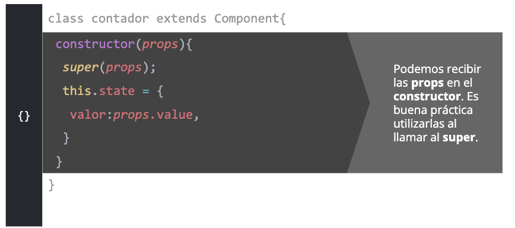

# CLASE 52 - El ciclo de vida de los componetes 
* Componentes stateful
* State y setState
* Eventos
* Ciclo de vida
* Integración con APIs

# Componentes stateful
Los componentes stateful, o con estado, son aquellos que poseen información interna que a su vez puede ser modificada propiamente por estos componentes.

Este tipo de componente es sumamente funcional dado que nos permite dejar de depender de las props para trabajar con información dinámica.

Sin embargo, bajo esta consigna no debemos pensar que ahora todos nuestros componentes deberán ser "de estado", ya que dicha decisión dependerá del contexto dentro del que se utilice dicho componente.

* Los componentes con estado son aquellos que pueden cambiar su contenido interno a partir de eventos externos.

## Componentes stateful
Los componentes stateful —o componentes con estado— son aquellos que están atentos a los eventos que los rodean y saben reaccionar a los mismos. En función de esos eventos, el componente podrá cambiar su contenido interno. 

Estos componentes ya no serán funciones nativas de JavaScript, sino que los trabajaremos como un nuevo tipo de dato: una clase.

```js 
class Producto extends Component {
 //...
}
```
```js
import React, { Component } from 'react';
class NombreComponente extends Component {
render () {
   return (
 // código a renderizar ...
);
};
}
export default NombreComponente;
{}
```


Solemos utilizar los componentes stateful cuando esperamos cierta interacción del usuario y, en base a eso, queremos que el interior de nuestro componente cambie. 
Los componentes stateful son reactivos y por ende el DOM se actualiza cuando es necesario. 

# state y setState
El estado de un componente es aquel que permite que el mismo pueda guardar información internamente.

Al estado de un componente lo llamamos "state". Este es un objeto literal (clave/valor) que almacenará la información que deseemos.

Por otro lado, el setState() es un método que nos va a permitir actualizar el estado cuando lo estimemos necesario, logrando así que sea el mismo componente quien se encargue de administrar esta información.

## state 
En su momento, dijimos que una de las razones por las cuales React nos beneficia es la actualización por componentes del DOM.
También, dijimos que los componentes con estado eran reactivos a las interacciones con el usuario y que, en base a eso, seactualizaban o no.
Ahora, llegó el momento de fusionar estas dos características de React y empezar a usarlas. 
Vamos a ver cómo usamos setState para cambiar el estado de nuestros componentes, ya sea ante eventos de usuario, cambios en el servidor o cambios en los props. 
Veamos cómo se ve esto en el código con un breve ejemplo.

## Constructor





## Props

## setState


# Eventos
Los eventos dentro de un componente de React son funciones o métodos que van a tener toda la lógica que se realizará cuando el usuario interactúe con el componente.

Así como sucede en JavaScript Vanilla, dentro de React podemos encontrar los típicos eventos click, hover, focus, blur, submit, entre otros, y su implementación, si bien es un poco diferente, no dista mucho de lo que tradicionalmente solemos hacer cuando queremos implementar un evento a un elemento determinado.

## El método
Dentro de nuestro componente, definimos los métodos que establecen qué hacer cuando se llame al evento. 
Para definir un método, usamos la misma sintaxis que al momento de escribir una función, pero sin la palabra function


## El evento
Los eventos en React son los mismos que en JavaScript. Para hacer uso de ellos hay que tener en cuenta que:

▸ Se escriben en la etiqueta, como si fuera un atributo.

▸ Se nombran usando la palabra on seguida del nombre del evento, usando siempre camelCase.

▸ Se usan las llaves y la palabra reservada this para asociarlo con el método que queremos.


**Cualquier componente puede utilizar eventos. Ahora, si el evento modifica el estado del componente, el mismo debe ser un componente stateful, es decir, con estado.**

Así es como quedaría nuestro código completo. Habiendo definido el método, y luego el evento, vamos a tener una ejecución limpia de ambos.


# Ciclo de la vida
Seguramente alguna vez hemos pedido comida a domicilio (o delivery) desde alguna aplicación de esas que están de moda por estos días. Como habremos visto, después de enviar el pedido de comida, esta entra en un proceso de varias etapas.

Por ejemplo, lo primero que sucede es que la aplicación indica que está enviando la orden al restaurante. Después, cuando el restaurante confirma, lo que sucede es que la comida entra en proceso de "preparación". Una vez está lista, pasa a la etapa de "en manos del repartidor" y finalmente la comida llega a la etapa "entregada" para acabar con todo el proceso.

Lo anterior no es otra cosa más que el ciclo de vida de un pedido. Desde el punto inicial en donde se envío la orden, hasta el punto final en donde llega la comida a la mesa.

Así como sucede en este escenario, algo muy similar pasa con los componentes. React se encarga de hacer pasar los mismos por tres claras etapas, que se evidencian cuando el componente:
* Se muestra en pantalla (montaje).
* Sufre cambios (actualización).
* Deja mostrarse en pantalla (desmontaje).
 
 A todo este proceso React lo llama el "ciclo de vida" y es algo muy importante de entender, ya que a lo largo de estas tres etapas vamos a poder generar distintas funcionalidades si así lo quisiéramos.

 

# Métodos que utilizamos para definir cada uno de los ciclos de vida de un componente.

### componentDidMount()
```js
componentDidMount(){
console.log('El componente fue renderizado');
}
```
Solemos utilizar este método para identificar el momento del ciclo vida del componente donde se ha renderizado por primera vez. Tengamos en cuenta que este método solo se ejecuta después de la primera renderización, del lado del usuario, por ende lo veríamos a través de la consola del navegador.
Uno de sus usos más comunes es, por ejemplo, encargarse de hacer algún pedido asincrónico (quizás a alguna API) una vez que el componente fue renderizado.

### componentDidUpdate()
```js
componentDidMount(){
console.log('El componente fue renderizado');
}
```
Método que utilizamos para identificar cuando un componente fue actualizado. Es decir, cuando sufrió ciertos cambios que hayamos programado en nuestro proyecto.

### componentWillUnmount()
```js
omponentDidMount(){
console.log('El componente fue renderizado');
}
```
Método que utilizamos para identificar el momento en que un componente va a dejar de existir. Es decir, no va a volver a ser renderizado. Dentro del método solemos hacer una “limpieza” de cualquier otro método que haya estado utilizando el componente que, de ahora en más, no va a volver a ser renderizado

# Integración con APIs
Con React, podemos usar cualquier biblioteca AJAX. Algunas de las más populares son: Axios, jQuery AJAX, y window.fetch, la cual es soportada de manera nativa en la mayoría de los navegadores modernos.

## componentDidMount()
Dentro de este método que identifica la fase del ciclo de vida del componente, justo después de la primera vez que fue renderizado, es donde debemos ir a buscar la información que queremos de la API. 
Veamos a continuación cómo se vería esto en el código.


## render()
Dentro del método render() es donde vamos a imprimir esa información que fuimos a buscar a la API. Sin embargo, en este método debemos contemplar un escenario donde la información quizás todavía no fue buscada, ya que el fetch() lo ejecutamos una vez que el componente fue renderizado. 

Por esta razón, el código se vería algo así..


