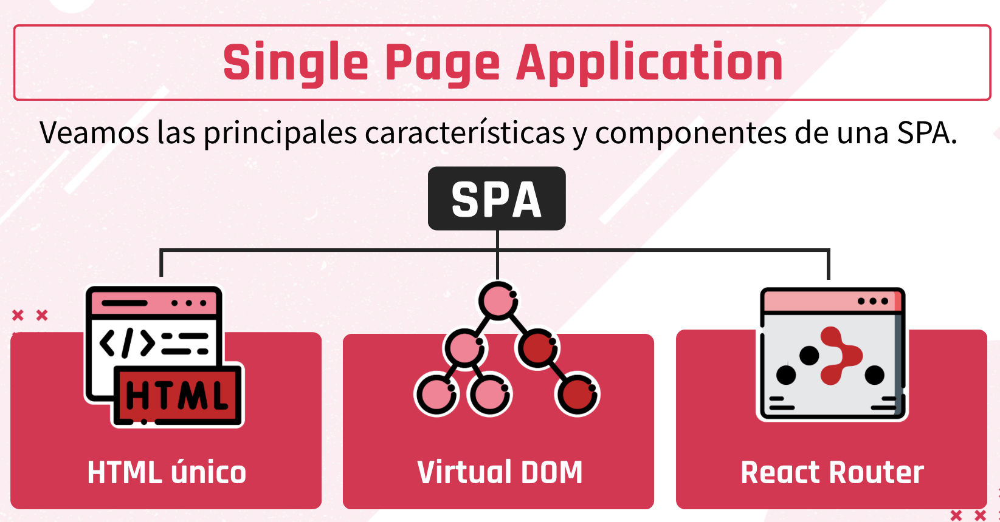
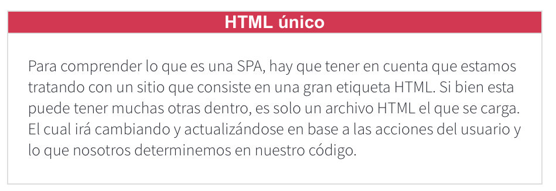
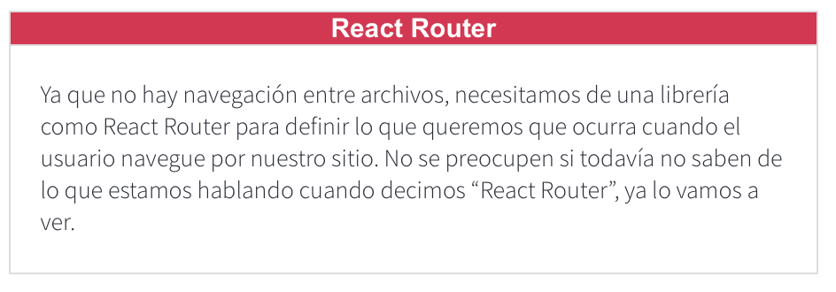
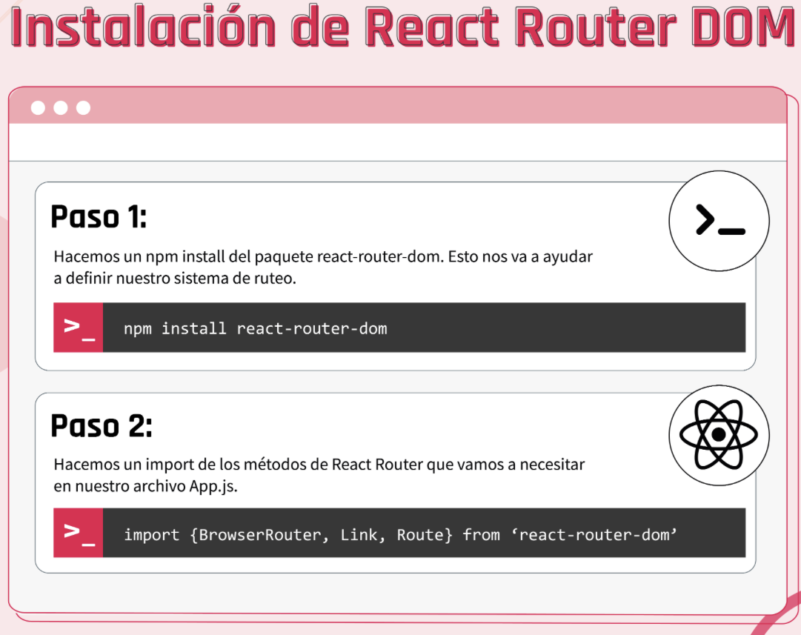
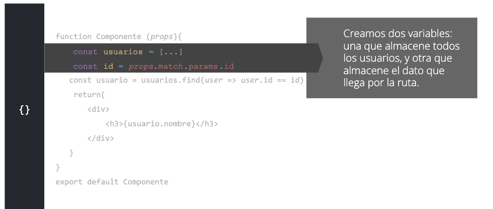
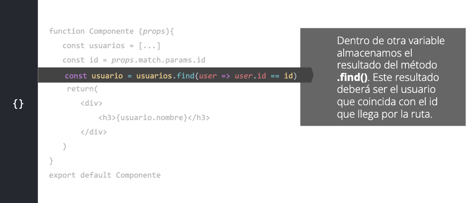
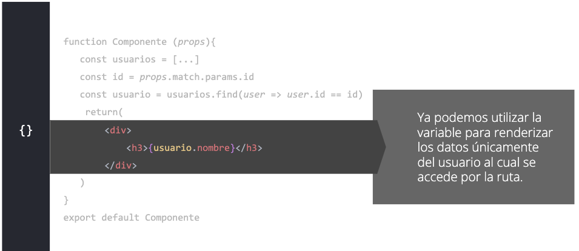

# CLASE 53 - Enlazando Los Componentes de la app
## Temas
 La librería React Router nos da la posibilidad de renderizar uno u otro componente dependiendo de la ruta a la que accedemos desde la barra de direcciones del navegador.

* Reconocer la diferencia entre las rutas de React y las rutas de la aplicación de Express.
  
* Implementar un sistema de ruteo para una aplicación de React que permite renderizar distintos componentes.
* Generar una vista "404 not found" cuando no existan componentes para mostrar en una ruta determinada.
* Renderizar un componente de manera dinámica desde una ruta con parámetros.

## Temas
1. SPA
2. Instalando React Router Dom
3. Componentes que provee React Router Dom
4. Creando la primera ruta y renderizando el componente específico
5. Cómo hacer switch de rutas y componentes
6. Cómo trabajar con rutas parametrizadas

# SPA (Single Page Application)
Es una aplicación web en la cual solo existe un único punto de entrada, generalmente un archivo index.html.
En una SPA no hay ningún otro archivo HTML al que se pueda acceder de manera separada, pues todo el contenido de la aplicación será cargado y renderizado dentro del mismo archivo index.html.

**Dentro de este contexto, aunque solo tengamos un archivo, seguimos contando con la posibilidad de tener varias vistas que se irán intercambiando en su visualización, produciendo así el efecto de que dentro de la aplicación existen varias "páginas" o "archivos" de contenido, cuando la realidad es que todo se está mostrando desde un único archivo.**

Una SPA ofrece, a su vez, una experiencia de usuario bastante agradable y fluida. Al no tener que cargar otro archivo distinto, la carga de contenido será mucho más rápida. Y es aquí en donde el Virtual DOM de React cobra un real protagonismo. Gracias a su existencia será posible identificar qué contenido de la vista tiene que cambiar y qué contenido tiene que mantenerse.






# Instalando React Router DOM
Para permitir que nuestra aplicación de React se comporte como un SPA real, tendremos que instalar una librería adicional que nos permita gestionar el sistema de ruteo de una manera óptima e inteligente, y así poder renderizar los componentes de la aplicación selectivamente dependiendo de la ruta presente en la barra de direcciones del navegador.



# Componentes que nos provee React Router
Cuando decimos que queremos utilizar React Router DOM, luego de hacer el npm install react-router-dom, debemos importarlo de la siguiente manera

```js
import {BrowserRouter, Link, Route, Switch} from 'react-router-dom'
```

¿Por qué lo hacemos así?
**Lo que estamos haciendo es importar Componentes que trae el módulo react-router-dom.**
¿Qué hacen estos módulos?
¡Vayamos a verlo!

**Los componentes que trae React Router son aquellos que nos permiten configurar nuestro sistema de navegación dentro de nuestra Single Page Application.**

## BrowserRouter
Este componente es el enrutador general y necesario para administrar las rutas de nuestro proyecto. Es como una envoltura de enrutación para nuestro proyecto.
Se utiliza de la siguiente manera:

```js
ReactDOM.render(
 <BrowserRouter>
   <App />
 </BrowserRouter>,
 document.getElementById("root")
);
```

## Link
Este componente es el que define las rutas de nuestro proyecto. Tiene como atributo el to=”/”, que siempre va a llevar a alguna etiqueta <a.> donde el to=”/” coincida con el href=”/”.
Se implementa de la siguiente manera: 

```js
Link to="/">Home</Link>
// <a href="/">Home</a>
```

## Switch y Route
Ambos buscan la similitud de rutas entre sí hasta encontrar una que coincida para renderizar. Cuando <Switch/> es renderizado, busca entre sus componentes hijos <Route/>, hasta que las rutas coinciden y finalmente esa será renderizada

```js
Switch>
     <Route path="/nosotros">
       <Nosotros />
     </Route>
     <Route path="/contacto">
       <Contacto />
     </Route>
     <Route path="/">
       <Inicio />
     </Route>
   </Switch>
```

# Creando la primera ruta y renderizando el componente específico
Propone renderizar un componente dependiendo de la ruta presente en la barra de direcciones del navegador.

 Para crear nuestra primera ruta debemos hacer uso de los componentes que nos trae React Router DOM: BrowserRouter, Link y Route.

 ## Requisitos
Repasando lo que hemos visto hasta ahora, hagamos cuenta de lo que necesitamos tener ya listo en nuestro proyecto para poder comenzar a crear las rutas
1. nstalar el módulo de react-router-dom
```
npm install ‘react-router-dom’
```
2. Importar el módulo y sus componentes
```js
import {BrowserRouter, Link, Route, Switch} from 'react-router-dom'
```
3. Englobar el componente <App/> dentro del componente <BrowserRouter/>.
```js
ReactDOM.render(
 <BrowserRouter>
   <App />
 </BrowserRouter>,
 document.getElementById("root")
);
```

## Route
El componente <Route/> lleva dos atributos, path=”” y component={}. Ambos nos ayudan a configurar qué componentes se deben renderizar en base a la ruta que se esté accediendo. Si queremos crear una ruta que renderize cierto componente, debemos asegurarnos de importar tal componente para poder usarlo de la siguiente manera

```js
import About from './components/About';
import Home from './components/Home';
import Contact from './components/Contact';
{}
```
```js
<Route path="/about" exact={true} component={About}/>
<Route path="/contact" exact={true} component={Contact}/>
<Route path="/" exact={true} component={Home}/>
```
**Recordemos que utilizamos la props exact={true}, ya que si no, React Router DOM va a renderizar siempre el componente <Home/>, porque encuentra una similitud entre las rutas (todas comienzan con ‘/’). Al utilizar la props  exact={true}, establecemos que solo queremos que se renderize <Home/> cuando la ruta sea exactamente ‘/’.**

## Link
Es un componente que asimila un enlace tradicional, pero es clave comprenderlo ya que nos va a permitir construir de manera efectiva y real nuestra SPA. 
Lleva dos props to=”” y exact=””. A través de estas, vamos a estar configurando nuestro sistema de ruteo. El componente <Link/> se utiliza de la siguiente manera:

```js
import About from './components/About';
import Home from './components/Home';
import Contact from './components/Contact';
{}
```

```js
// Dentro del archivo App.js
   <div className="App">
     <Link to="/about" exact="true">About</Link>
     <Link to="/contact" exact="true">Contact</Link>
     <Link to="/" exact="true">Home</Link>
     <Route path="/about" exact={true} component={About}/>
     <Route path="/contact" exact={true} component={Contact}/>
     <Route path="/" exact={true} component={Home}/>
   </div>
```

# Cómo hacer switch de rutas y componentes
Cómo se puede hacer un "switch" de componentes dependiendo de la ruta y adicionalmente cómo poder renderizar un componente "404 not found" para cuando la ruta ingresada por la persona que visita nuestra aplicación, no coincida con ninguna de la rutas generadas dentro de la aplicación.

**Switch es un componente de React Router que permite buscar la coincidencia con alguna de las rutas que hayamos definido con Route**

## Importación
Ya que Switch es un componente de React Router, debemos importarlo. 

Esto lo hacemos de la misma manera en la que requerimos todos los otros 
componentes de React Router que estuvimos utilizando. 

Como BrowserRouter, Link y Route.
Nuestra línea de código se debería ver algo así:

```js
import {BrowserRouter, Link, Route, Switch} from 'react-router-dom'
```

## Implementación
El componente <Switch/> va a albergar todos los componentes <Route/> que tengamos definidos. 

Se recomienda agregar, a lo último, un componente <Route/> sin especificar ruta alguna y que se encargue de renderizar el componente que tengamos listo para mostrar cuando se acceda a una ruta desconocida. 

<Switch/> nos va a permitir renderizar este componente solamente si la ruta ingresada no coincide con ninguna de las que hayamos establecido. 

```js
<Switch>
      <Route path="/" exact={true} component={Home} />     
      <Route path="/about" component={About} />
      <Route path="/contact" component={Contact} />
      <Route component={Error404} />
    </Switch>
```

## Link, Route y Switch
Llegó el momento de fusionar todo lo que vimos hasta el momento sobre componentes de React Route

Así se vería nuestro código implementando <Link/>, <Route/> y <Switch/>.

Recordemos que para que esto funcione, debemos previamente haber importado los componentes que queremos renderizar. 

```js
<Link to="/" exact="true">Home</Link>
     <Link to="/about">About</Link>
     <Link to="/contact">Contact</Link>
    <Switch>
      <Route path="/" exact={true} component={Home} />     
      <Route path="/about" component={About} />
      <Route path="/contact" component={Contact} />
      <Route component={Error404} />
    </Switch>
```

# Cómo trabajar con rutas parametrizadas
React (gracias a React Router) es posible generar rutas parametrizadas para que con ellas podamos cargar un mismo componente, pero de manera dinámica.

¿De manera dinámica? ¿Cómo?

Imaginemos que tenemos un componente que posee dentro un array de productos y que queremos mostrar un producto específico dependiendo del id que nos pasen a través de la ruta en la barra de direcciones del navegador.

Seguramente bajo este escenario, vamos a querer encontrar una manera en la que podamos capturar el id desde la ruta y, en función del mismo, elegir qué producto mostrar.

Pues bien, esto es lo que React Router nos va a permitir hacer a través de las rutas parametrizadas. Pero no hablemos más y veamos en acción como se puede llevar a cabo este proceso.

**React Router nos permite guardar valores en las rutas parametrizadas. Esto nos permite renderizar valores dentro de los componentes dependiendo de la información que nos llega por la ruta.**

## Definición
Cuando queremos comenzar a trabajar con rutas parametrizadas, lo primero que tenemos que hacer es definirlas

Esto lo hacemos desde las rutas que definimos en el componente <Route/>.

Las rutas parametrizadas llevan dos puntos (:) y el nombre del dato. Es importante elegir el nombre del dato coherentemente porque es el nombre que luego usaremos para trabajar sobre él.

Nuestra ruta se debería ver algo así:
```js
<Route path="/usuarios/:id" component={Usuarios} />
```

## props.match
React Router nos provee de props que contienen información sobre la ruta que establecimos en el componente <Route/>.

Para usar las props, debemos definirlas como parámetro de la función de nuestro componente.

Dentro de las props, encontramos la propiedad .match, la cual nos ofrece la propiedad .params

Esta propiedad contiene la información que viaja a través de la ruta parametrizada y por eso se torna importante en nuestro componente

A través de ella podemos buscar los datos del producto que queremos renderizar. 

Si queremos acceder al valor que viajó por ruta, deberíamos hacerlo de la siguiente manera dentro de nuestro componente.

Tengamos en cuenta que este fue el nombre que le asignamos a nuestra ruta.

```js
<Route path="/usuarios/:id" component={Usuarios} />
```

```js
function Componente (props){
   const id = props.match.params.id
    return(
       <div></div>
   )
}
export default Componente
{}
```

## Implementación


