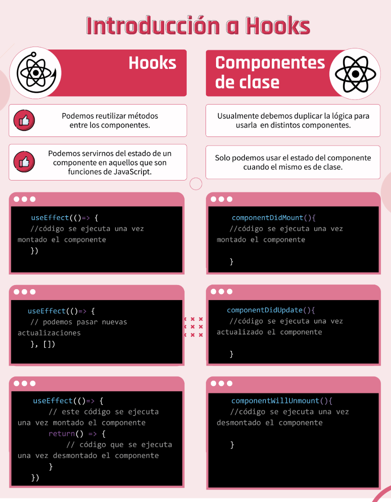

#   CLASE 54 - Hooks
A esta altura, ya sabemos que dentro de React existen dos tipos de componentes: los stateless y los stateful. Y seguramente asociemos a cada uno con un tipo de código en particular. Por ejemplo, si tuviéramos que pensar en un componente stateful, lo más seguro es que nos imaginemos un componente de clase. Y si bien esto es correcto, ahora veremos que los componentes “tipo función” también pueden tener un estado.

React, en sus últimas versiones ha implementado la posibilidad de asignar estados, ciclos de vida y demás, a un componente funcional, ya que de esta manera busca romper la brecha diferencial en la implementación entre los componentes con y sin estado.

Pero, entonces, si un componente funcional puede tener estado, ¿qué sentido tiene haber visto los componentes de clase? Esta funcionalidad es relativamente nueva, por lo que es posible que algunos proyectos de React hechos con versiones anteriores, presenten componentes de clase. En cuyo caso, debemos estar preparados para saber cómo manejarlos.

## Temas 
* Qué son los Hooks y qué beneficios aportan en la creación de componentes.
* Cuáles son los Hooks más importantes dentro de este contexto.
* Cómo trabajar con los Hooks: useState(), useEffect() y useRef().
* Cuál es la similitud de estos Hooks respecto a las funcionalidades de un componente de clase.

## Titulos
1. Intro a Hooks
2. useStape()
3. useEffect()
4. useRef()

# Intro a hooks
Lo primero que debemos tener en claro es que los Hooks NO funcionan dentro de un componente de clase. Eso es lo llamativo de ellos, pues con los mismos vamos a poder generar muchas funcionalidades asociadas tradicionalmente a dichos componentes, pero dentro de un componente funcional.

Entonces, ¿qué son los Hooks?

Los Hooks básicamente son funciones puras de JavaScript que nos van a permitir "enganchar" características —como el ciclo de vida y el estado— a componentes que no sean de clase, o sea a los componentes funcionales. Según la documentación oficial de React: "... los Hooks no funcionan dentro de un componente de clase. Ellos están pensados para usar sin clases".

## ¿Por qué nos conviene usar los Hooks?

Como ya dijimos anteriormente, los Hooks nos dan la facultad de tener disponible el ciclo de vida y el estado dentro de componentes funcionales. Gracias a esto, no vamos a tener que generar un componente de clase para usar dichas características.

Esto es tremendamente poderoso, porque, de esta forma, ya no va a importar tanto dentro de qué tipo de componentes estemos, lo realmente importante aquí es saber que, de ser necesario implementar un estado o el ciclo de vida, lo vamos a poder hacer.

Además, de ahora en adelante, cuando queramos implementar el estado, ya no lo vamos a tener que hacer a partir del constructor de la clase, como lo hacíamos anteriormente. Y tampoco si queremos actualizarlo, vamos a tener que usar el método setState(). Al ser los Hooks funciones puras, estos procesos los vamos a poder implementar de manera más sencilla.

Estas son las razones fundamentales del porqué nos conviene usar hooks.

# useStape()
Este es el hook más famoso y el que trae consigo la funcionalidad más clara para entender qué son los Hooks.

Recordemos, por un momento, la manera en la que se debe configurar el estado dentro de un componente de clase.

Para ello era necesario usar el constructor de la clase e incluso también llamar al método super() para que todo saliera según lo esperado. Así como también cuando queríamos actualizar el estado, se hacía necesario usar el método setState(), perteneciente a la misma clase.

Ahora con los Hooks para lograr el mismo resultado, va a ser mucho más fácil, ya que lo único que tendremos que hacer es usar useState() y listo. Eso es todo.

¿Mucho más simple verdad?

Pero vayamos mejor a ver en detalle esto en el siguiente video, así podemos entender con más claridad cómo trabajar con el estado del componente gracias a este Hook.

# useEffect()
Este Hook es todo lo que necesitamos para gestionar el ciclo de vida de un componente.

En esta sola función tenemos la posibilidad de controlar lo que pasa cuando: se monta el componente, se actualiza o se desmonta. Es súper funcional y relativamente sencillo de utilizar.

Al servir para hacer tres cosas al mismo tiempo, es importante entender cómo poder configurarlo para que haga una cosa o la otra, pero no va a ser algo muy complicado. Justamente este Hook busca romper un poco la brecha de dificultad que presentaba el ciclo de vida en los componentes de clase.

# useRef()
Este Hook permite seleccionar elementos del DOM de manera fácil y sencilla, tal como hacíamos con el querySelector de JavaScript Vanilla.

useRef() es realmente sencillo de usar. Lo único que necesitamos es ejecutarlo y guardar su valor de retorno dentro de una variable y, posteriormente, usar dicha variable dentro de la estructura HTML del elemento que deseamos capturar.